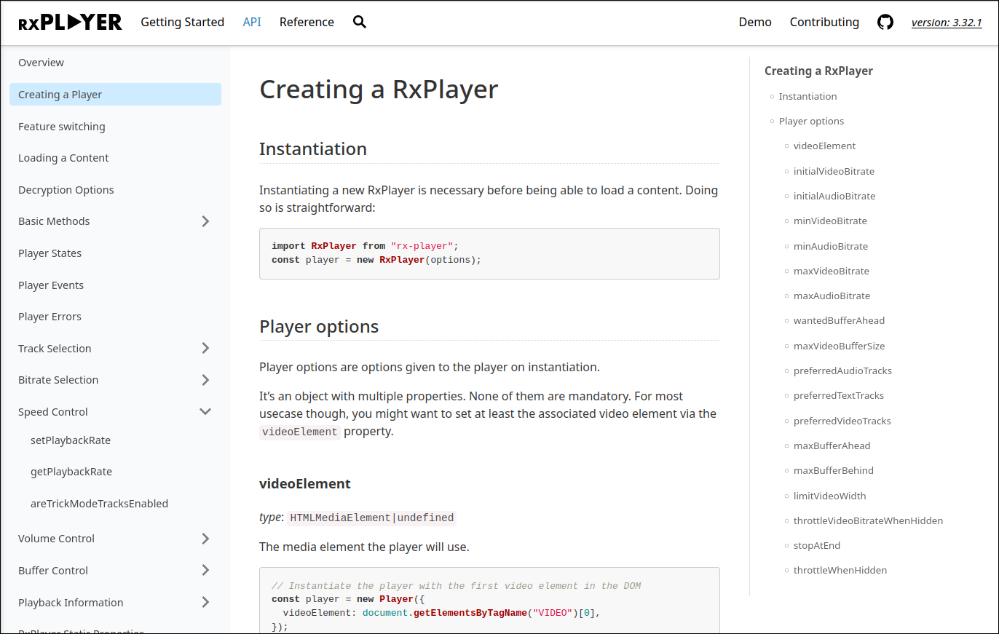
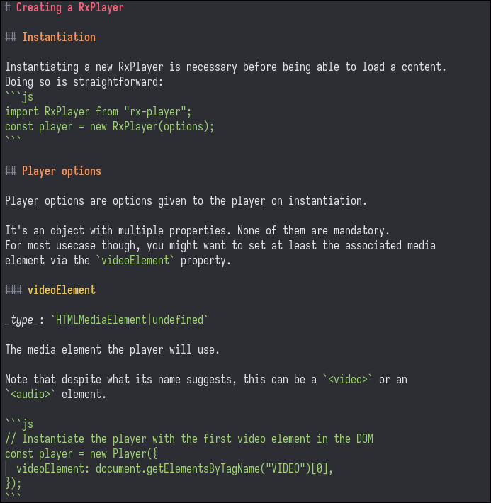

# README

README (for Readme's an Extremely Accessible Documentation MakEr) is a very
simple HTML documentation generator whose goal is to be as pain-free as
possible to put in place, maintain and navigate.

<div style="text-align:center; width:100%">

<br>
<i>Example of the output generated by README</i>
<br>
<br>
</div>

The basic idea is that you can just write your own documentation as
markdown files with no specific syntax on top of it.
Those files can then consequently be read and updated directly in an editor with
no tool-specific knowledge and also be displayed in various tools doing markdown
formatting (e.g. editor plugins, GitHub's interface for source files...).

<div style="text-align:center; width:100%">

<br>
<i>Markdown source file for the previous example</i>
<br>
<br>
</div>

`README` can then produce an HTML documentation from it, keeping the
same file structure, by adding a few `.docConfig.json` files in the directories
already-exposing your documentation.

## Example

If you want to see an example of the pages generated by that tool, you can look
at the [RxPlayer's documentation](https://developers.canal-plus.com/rx-player/doc/Getting_Started/Welcome.html)
and compare it to its [original markdown files](https://github.com/canalplus/rx-player/tree/master/doc/Getting_Started).

_Yes we should probably have generated that tool's documentation through it
instead, but we wrote this README in a haste so maybe for later :p._

## Installation

The README project is published under the `@canalplus/readme.doc` name on npm:

```sh
npm install @canalplus/readme.doc --save-dev
```

Or through yarn:

```sh
yarn add @canalplus/readme.doc --dev
```

It is then runnable (e.g. as an npm script in your `package.json` or through
`npx`) through the `readme.doc` name:

```sh
readme.doc src dest
```

See below for more details on how to run it.

## How to use it

If you want to use this, just create a directory where you documentation is, put
a `.docConfig.json` JSON file at its root with the following format:

```json
{
  // Optional object to define a logo which will be located on the top left of
  // each page. That logo is optionally a link to some other page.
  "logo": {
    // Local path (can be relative to the current directory) to the image of the
    // logo
    "srcPath": "./images/logo.png",

    // Optional link to redirect to when the logo is clicked. Can be ignored in
    // which case the logo is not clickable
    "link": "https://homepageoftheproject.html"
  },

  // Optional object to define a favicon for the documentation pages
  "favicon": {
    // Local path (can be relative to the current directory) to the image of the
    // favicon
    "srcPath": "./images/favicon.ico"
  },

  // Optional link when clicking on the current version which is optionally
  // displayed on the page (see below)
  // Can be ignored in which case the version is not clickable
  "otherVersionsLink": "https://example.com/documentation_pages_by_version.html",

  // Links available at the top of the page, on the left-side of it from left to
  // right.
  //
  // Each of those items will have a format which is dependant on its `"type"`
  // property. We'll look over all possibilities.
  "linksLeft": [
    {
      // `"local-doc"` are relative links to where your markdown documentation
      // is. You can see below more information on how you can organize the
      // corresponding directory.
      "type": "local-doc",

      // Relative path to that directory.
      "path": "./Getting_Started",

      // Name displayed for the link to that directory on the generated HTML pages.
      "displayName": "Getting Started"
    },
    {
      "type": "local-doc",
      "path": "./api",
      "displayName": "API"
    },
    {
      // `"link"` are external links. You will quit the documentation when
      // clicking on it.
      "type": "link",

      // The corresponding link
      "link": "https://www.example.com/demo/",

      // Name displayed for the link to that directory on the generated HTML pages.
      "displayName": "Demo"
    },
    {
      // Special type which leads to be able to search documentation
      // The documentation is automatically generated and is done entirely through
      // JavaScript, without relying on external actors.
      "type": "search"
    }
  ],
  "linksRight": [
    {
      // `"github-link"` is a special kind of link (with its own logo),
      // redirecting to the github link of the project, if one.
      //
      // Yes, I should probably also either do gitlab, sourcehut etc. or just
      // provide some generic mean but this is just a quick project after all
      "type": "github-link",

      // Corresponding link
      "link": "https://github.com/name/repo"
    },
    {
      // Special type which displays the current project's version.
      // It is optionally clickable depending on if you defined the
      // `otherVersionsLink` property
      "type": "version"
    }
  ]
}
```

You can then put your documentation files as markdown files in the directory
previously signaled through `"local-doc"` links (e.g. in the `linksLeft` or
`linksRight` property above).

Those markdown files don't have to contain anything special other than the usual
CommonMark-compatible markdown and links between markdown files or to images
will automatically be translated once the corresponding HTML is generated.

In those directories, you can create subdirectories to group documentation
markdown files together.
This will be reflected in the generated doc as a documentation group. For now,
there can be only one level of subdirectories (which means the `"local-doc"`
directory and its subdirectories, no further ones inside the latter).

At last, in each of the directories where markdown files are (the `"local-doc"`
directories and their optional subdirectories), add another `.docConfig.json`
file, with a single `pages` property.

```json
{
  // Documentation pages, that will be linked from top to bottom
  "pages": [
    {
      // Relative path to the markdown file.
      "path": "./Welcome.md",

      // Name actually displayed for the link to it on the generated HTML page
      "displayName": "Welcome"
    },
    {
      // Relative path to a subdirectory
      "path": "./Tutorials",

      // Name actually displayed for this directory's title on the generated
      // HTML page
      "displayName": "Tutorials"
    }
    // ...
  ]
}
```

You can then generate the doc by running:

```sh
readme.doc <PATH_TO_THE_DOC_ROOT> <PATH_FOR_THE_GENERATED_PAGES> ["<OPTIONAL_VERSION>"]
```

Where:

- `PATH_TO_THE_DOC_ROOT`: is the original root where your initial
  `.docConfig.json` is
- `PATH_FOR_THE_GENERATED_PAGES` is the path where the corresponding HTML
  pages will be generated. It can also be inside
  `PATH_TO_THE_DOC_ROOT` if you want.
- `OPTIONAL_VERSION` is completely optional and is the current version of the
  project, which might be used depending on your configuration.

You then have all your generated HTML documentation pages inside
`PATH_FOR_THE_GENERATED_PAGES`.

That's all folks!

## Why a new documentation generator

We're also working on the [RxPlayer](https://github.com/canalplus/rx-player/)
project, an adaptive media player library with a relatively complex and
technical API.
As its API is large and has many complex behaviors, we decided that having
an intelligible, large and useful documentation was a central goal of this
project.

Consequently, we put special care on how that documentation can be read, updated
and presented. In that process we tried several other documentation generators,
among them:

- `docusaurus` was too huge, complex, tightly-linked to other solutions like
  react and algolia (at least last time we checked) and it added its own
  syntax on top of markdown.

  We would prefer a simple tool and also be able to look to the original
  markdown files with no such supplementary syntax.

- `docsify` runs JavaScript to translate markdown on the fly. We would prefer
  to have the HTML files already generated and also make our documentation
  accessible to those who do not enable JavaScript.

We ended up finding that improving on our initially minimalist homemade
documentation generator by picking some of the interesting features of other
generators (documentation page list on the left, table of contents on the
right, soft navigation for loading-free page switching, search feature relying
on a locally-loaded index etc.) was relatively straightforward, hence
`README.js`.

It was initially present inside the RxPlayer's repository, but we found that it
made more sense to externalize that code and its dependencies through another
repository once it became large enough, with the goal of letting it generate the
documentation of other tools.
